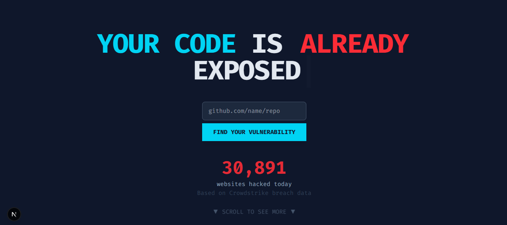
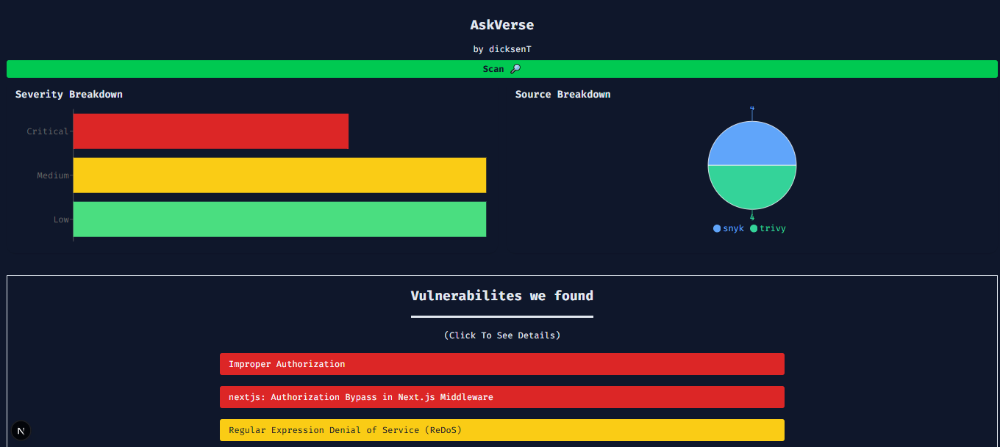
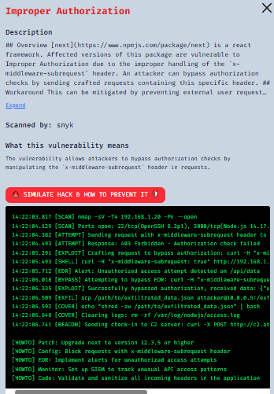

# 🛡️ Shift-Left – Dev-First Security Dashboard

**Shift-Left** helps developers catch and understand security risks *before code is deployed*.

It scans GitHub repos using **industry-standard tools** (Snyk, Trivy, Semgrep), simulates real-world attacks, and explains vulnerabilities in plain English — all in one clean, interactive dashboard.

---

## 🌐 Live Demo

👉 [shiftLeft.dicksentan.com](https://shiftleft.dicksentan.com)

> ⚠️ Cold start may take a few seconds. 

---

## Video Demo

👉 https://www.loom.com/share/2d3f8594c09f496ba2c145eb4d9872d5?sid=3a78e4cd-69ce-4bdd-b114-51e257e9c523

> Please understand im nervous 😬 (Open subtitle for more clarity)

---

## Screenshot





---

## 🔍 Key Features

- ✅ **Unified scanning pipeline** — integrates Snyk, Trivy, and Semgrep into a single flow
- 📊 **Interactive dashboard** — filter issues by severity, tool, and source file
- 🤖 **AI-powered insight** — plain-language vulnerability explanations (OpenAI)  
- 🐍 **HackMe simulator** — CLI-style terminal log of realistic attacks (SQLi, RCE, etc.)
- 🚀 **Deploy-ready architecture** — serverless Next.js API, Fly.io backend, Vercel UI
- 🔐 **Secure execution** — sandboxed scanners, streaming output, no GitHub login required

---

## 🛠 Tech Stack

| Layer       | Stack                                     |
|-------------|-------------------------------------------|
| Frontend    | Next.js 15, TailwindCSS, TypeScript       |
| Backend     | Node.js, Next.js API Routes, OpenAI SDK   |
| Scanners    | Snyk, Trivy, Semgrep (via CLI + `exec()`) |
| Deployment  | Vercel (UI) + Fly.io (API) + Docker       |

---

## ⚙️ How It Works

### 1. Paste a GitHub Repository URL

Paste any public repo (e.g. `https://github.com/vercel/next.js`) into the input box.

The app will:

- Clone the repo inside a temporary Docker container
- Run **Snyk**, **Trivy**, and **Semgrep** scans
- Normalize and visualize results

### 2. Explore Findings

Click a vulnerability card to see:

- 🤖 **AI Explanation** — plain-text breakdown of the risk
- 🚨 **Hack Simulation** — attack logs (e.g. `[INFO] SQL injection payload sent`)
- 🛡️ **Defense Tips** — mitigation advice (if detected)

---

## 🧱 Local Development

```bash
git clone https://github.com/DicksenT/shift-left.git
cd shift-left
npm install
npm run dev

---

## 🔐 Environment Variables

Create a `.env.local` file:

```env
OPENAI_API_KEY=your-openai-key
SNYK_TOKEN=your-snyk-token
